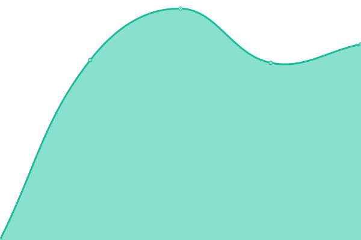

# [📈 Live Status](https://status.dominiklawetzky.de): <!--live status--> **🟧 Partial outage**

This repository contains the open-source uptime monitor and status page for [Upptime](https://upptime.js.org), powered by [Upptime](https://github.com/upptime/upptime).

With [Upptime](https://upptime.js.org), you can get your own unlimited and free uptime monitor and status page, powered entirely by a GitHub repository. We use [Issues](https://github.com/upptime/upptime/issues) as incident reports, [Actions](https://github.com/upptime/upptime/actions) as uptime monitors, and [Pages](https://status.dominiklawetzky.de) for the status page.

<!--start: status pages-->
<!-- This summary is generated by Upptime (https://github.com/upptime/upptime) -->
<!-- Do not edit this manually, your changes will be overwritten -->
<!-- prettier-ignore -->
| URL | Status | History | Response Time | Uptime |
| --- | ------ | ------- | ------------- | ------ |
|  [Dominik Lawetzky](https://dominiklawetzky.de) | 🟩 Up | [dominik-lawetzky.yml](https://github.com/dominiklawetzky/status-page/commits/HEAD/history/dominik-lawetzky.yml) | 

 1029ms
     
 | 

<a href="https://status.dominiklawetzky.de/history/dominik-lawetzky">100.00%</a>
    

|  [Grüne Jugend Rheingau-Taunus](https://gj-rtk.de) | 🟩 Up | [gruene-jugend-rheingau-taunus.yml](https://github.com/dominiklawetzky/status-page/commits/HEAD/history/gruene-jugend-rheingau-taunus.yml) | 

 404ms
     
 | 

<a href="https://status.dominiklawetzky.de/history/gruene-jugend-rheingau-taunus">83.39%</a>
    

|  [Politik und Wirtschaft](https://politikundwirtschaft.de) | 🟩 Up | [politik-und-wirtschaft.yml](https://github.com/dominiklawetzky/status-page/commits/HEAD/history/politik-und-wirtschaft.yml) | 

 947ms
     
 | 

<a href="https://status.dominiklawetzky.de/history/politik-und-wirtschaft">0.18%</a>
    

|  [Test Broken Site](https://thissitedoesnotexist.koj.co) | 🟥 Down | [test-broken-site.yml](https://github.com/dominiklawetzky/status-page/commits/HEAD/history/test-broken-site.yml) | 

 0ms
     
 | 

<a href="https://status.dominiklawetzky.de/history/test-broken-site">100.00%</a>
    

<!--end: status pages-->

[**Visit our status website →**](https://status.dominiklawetzky.de)

## 📄 License

- Powered by: [Upptime](https://github.com/upptime/upptime)
- Code: [MIT](./LICENSE) © [Upptime](https://upptime.js.org)
- Data in the `./history` directory: [Open Database License](https://opendatacommons.org/licenses/odbl/1-0/)
